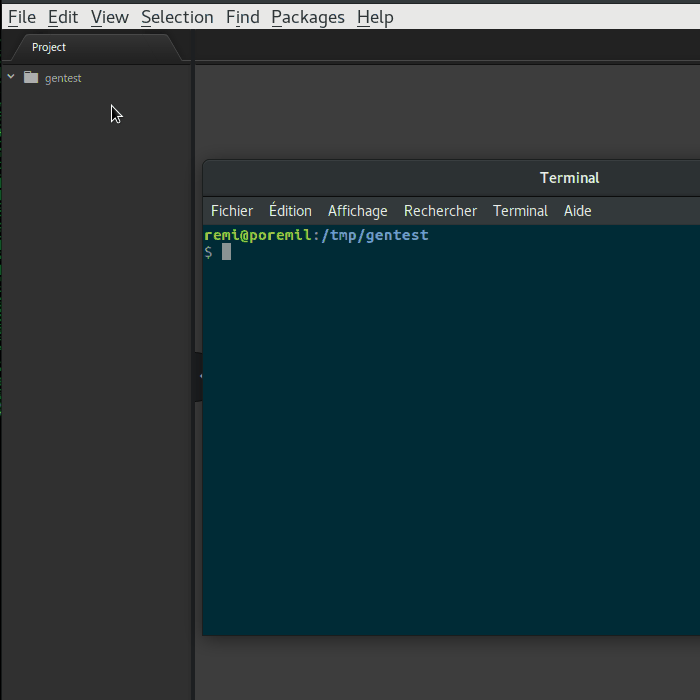
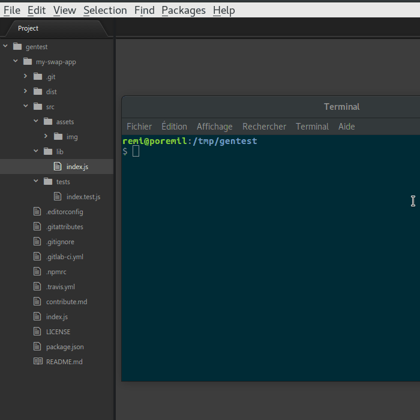
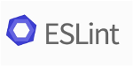

<h1 align="center">
  <a href="https://github.com/sirap-group"></a>
  <br>
  −− generate-swap-project −−
  <br>
  <br>
</h1>

<p align="center">
  <a href="https://travis-ci.org/rbecheras/generate-swap-project" target="_blank">
    
  </a>

  <a href="https://www.npmjs.com/package/generate-swap-project">
    
  </a>

  <a href="https://npmjs.org/package/generate-swap-project" target="_blank">
    
  </a>

  <a href="https://standardjs.com" target="_blank">
    
  </a>
</p>

<h4 align="center">
  −− Generate An ES.Next/StandardJS/UnitTest Ready, Github or Gitlab Project in Seconds! −−
  <br>
  −− A generator for SWAP projects −−
  <br>
  <br>
  <a href="https://www.npmjs.com/package/generate-swap-project" target="_blank">
    
  </a>
</h4>

## Demo example

Check out the following repository to see what a project generated with `generate-swap-project` looks like out the box:

> [https://github.com/rbecheras/swap-project-example](https://github.com/rbecheras/swap-project-example)

## Installation

```sh
$ npm install --global generate generate-swap-project
```

## Usage

```sh
$ gen swap-project
```

Should scaffold the project in the destination path you choose when asked.

### Generated files

```
.
├─┬ src/
| ├─┬ tests/
| | └─ index.test.js
| ├─┬ assets/
| | └─┬ img/
| |   └── ...
| └─┬ lib/
|   └─ index.js
├── contributing.md
├── .editorconfig
├── .git
├── .gitattributes
├── .gitignore
├── .gitlab-ci.yml
├── index.js
├── LICENSE
├── node_modules
├── .npmrc
├── package.json
├── README.md
└── .travis.yml
```

### Generating the `my-swap-app` project



### Then install dependencies and run the unit tests



## Available Generator's Tasks

### `swap-project:default`

Runs the `project` task.

```
$ gen swap-project
```

or

```
$ gen swap-project:default
```

### `swap-project:project`

Generate the whole project in the directory choosen by the user when in ask to the question.

Runs all the following tasks in the following order:

- `prompt`
- `dest`
- `package`
- `gitignore`
- `gitattributes`
- `editorconfig`
- `npmrc`
- `contributing`
- `license`
- `main`
- `readme`
- `travis`
- `gitlabci`
- `git`


```
$ gen swap-project
```

or

```
$ gen swap-project:default
```

### `swap-project:prompt`

Ask the user for all the required data for all the tasks in this generator.

```
$ gen swap-project:prompt
```

### `swap-project:dest`

Set the destination directory for generated files.

```
$ gen swap-project:dest
```

### `swap-project:package`

Generate a `package.json` file.

```
$ gen swap-project:package
```

The file includes:

- basic package.json fields
    - name
    - description
    - version
    - homepage
    - author
    - repository
    - bugs
    - license
    - files
    - main
    - engines
    - keywords
- dependencies
- devDependencies
- 27 yarn scripts
- babeljs config
- standardjs config

### `swap-project:git`

Create a local git repository, add all files in the directory and create a first commit.

```
$ gen swap-project:git
```

### `swap-project:gitignore`

Generate a file `.gitignore` in the destination directory.

```
$ gen swap-project:gitignore
```

### `swap-project:gitattributes`

Generate a file `.gitattributes` in the destination directory.

```
$ gen swap-project:gitattributes
```

### `swap-project:editorconfig`

Generate a file `.editorconfig` in the destination directory.

```
$ gen swap-project:editorconfig
```

### `swap-project:npmrc`

Generate a file `.npmrc` in the destination directory.

```
$ gen swap-project:npmrc
```

### `swap-project:contributing`

Generate a file `.contributing.md` in the destination directory.

```
$ gen swap-project:contributing
```

### `swap-project:lincense`

Generate a file `LICENSE` in the destination directory.

```
$ gen swap-project:lincense
```

### `swap-project:main`

Generate a file `main.js` in the destination directory.

```
$ gen swap-project:main
```

### `swap-project:readme`

Generate a file `README.md` in the destination directory.

```
$ gen swap-project:readme
```

### `swap-project:travis`

Generate a file `.travis` in the destination directory.

```
$ gen swap-project:travis
```

### `swap-project:gitlabci`

Generate a file `.gitlab-ci.yml` in the destination directory.

```
$ gen swap-project:gitlabci
```

## Contributing

### Codebase

The codebase is written using the [ESNext Specification](https://github.com/hemanth/es-next) (ECMAScript Stage 0), following the [StandardJS Code Style](https://standardjs.com/)

[](https://github.com/hemanth/es-next)
[](https://github.com/standard/standard)
[](https://eslint.org)
[](https://babeljs.io)
[](https://yarnpkg.com/en/)

We use:

- [Yarn](https://yarnpkg.com/fr/) to handle npm dependencies,
- [ESNext CLI](https://github.com/esnext/esnext) to transform ESx code to ESNext,
- [Babel CLI](https://babeljs.io/) to transpile ESNext code to node/browser compatible javascript,
- And [Standard CLI](https://www.npmjs.com/package/standard) + [ESLint](https://eslint.org) to lint or format ESNext codebase.

### Contribution guide

> See the [contribution guide](CONTRIBUTING.md) in a separated document.

### Development

#### Global dependencies

Get the latest node engine (example with `nvm`):

```sh
$ nvm install lts/carbon
```

Install yarn from npm (for development only):

```sh
$ npm install --global yarn
```

All the rest of the development dependencies are local.

#### Clone and install

Clone the repo and install dependencies:

```sh
$ git clone git@github.com:rbecheras/generate-swap-project.git
$ cd generate-swap-project
$ yarn install
```
#### Running test

Finally, run the test pipeline:

```sh
$ yarn pipeline:test
```

#### Available yarn scripts

| Task Command | Task description |
|---|---|
| `yarn clear` | Delete the `./build/` and `./dist` repositories |
| `yarn lint` | Lint source files |
| `yarn lint:esnext` | Lint ESNext source files |
| `yarn build` | Build the whole distribution |
| `yarn build:assets` | Build all the assets |
| `yarn build:assets:img` | Build the images assets |
| `yarn build:assets:templates` | Build the templates assets |
| `yarn build:lib` | Build only the lib |
| `yarn build:tests` | Build only the tests |
| `yarn build:docs` | **[TODO]** Build only the docs |
| `yarn test` | Run the tests in `./dist/tests/` |
| `yarn tests` | An alias for `yarn test` |
| `yarn travis` | Run the travis script |
| `yarn docs` | **[TODO]** Serve the docs |
| `yarn pipeline` | Run the complete pipeline |
| `yarn pipeline:test` | Run the required jobs to run the tests, then run the tests |
| `yarn pipeline:build` | Run the required jobs to build the dist, then build the dist |
| `yarn pipeline:docs` | **[TODO]** Run the required jobs to serve the docs, then serve the docs |
| `yarn pipeline:build:tests` | Run the required jobs to build the docs, then build the docs |
| `yarn pipeline:build:lib` | Run the required jobs to build the docs, then build the docs |
| `yarn pipeline:build:docs` | **[TODO]** Run the required jobs to build the docs, then build the docs |
| `yarn release` | An alias to `yarn release:patch` |
| `yarn release:prerelease` | Release and publish a new semver version (x.y.z-rc+1)|
| `yarn release:patch` | Release and publish a new patch semver version (`x.y.z+1`)|
| `yarn release:minor` | Release and publish a new minor semver version (`x.y+1.z=0`)|
| `yarn release:major` | Release and publish a new major semver version (`x+1.y=0.z=0`)|

#### Develop in BDD mode

> **B.D.D.** means **Behavior-Driven-Development**

The project is ready to code in BDD mode. Just run the `bdd` yarn command:

```
$ yarn bdd
```

The project will be lint, built, the BDD unit tests will be run, and the process will watch for any file changes to loop over the previous tasks (`lint`, `build`, `test`, `watch`).

#### Releasing a new version

The task `yarn pipeline:build` generate a `./dist` folder in the repository's root directory but this folder is not part of the git repository (there is an entry in the `.gitignore` file). However the dist folder is included in the `package.json#files` field.

Thus to release a new, lets say, "patch" version, just run:

```sh
$ yarn release:patch
```

The whole build pipeline is run locally (lint, transpile, test) and then a new git tag and a new npm tag are pushed up.

## Related projects

### SWAP Generators

* [generate-swap-generator](https://npmjs.com/generate-swap-generator) Generate your own ESNext/StandardJS/UnitTest Ready Generators − A generator for SWAP generators [github](https://github.com/rbecheras/generate-swap-generator) | [homepage](https://rbecheras.github.io/generate-swap-project/)

### Generator library stack

* [generate](https://npmjs.com/generate) A new command line tool and developer framework for scaffolding out GitHub projects. Generate offers the robustness and configurability of Yeoman, the expressiveness and simplicity of Slush, and more powerful flow control and composability than either [github](https://github.com/generate/generate) | [homepage](https://generate.github.io/generate/)
* [base](https://www.npmjs.com/package/base): Framework for rapidly creating high quality node.js applications, using plugins like building blocks | [homepage](https://github.com/node-base/base "Framework for rapidly creating high quality node.js applications, using plugins like building blocks")
* [update](https://www.npmjs.com/package/update): Be scalable! Update is a new, open source developer framework and CLI for automating updates… [more](https://github.com/update/update) | [homepage](https://github.com/update/update "Be scalable! Update is a new, open source developer framework and CLI for automating updates of any kind in code projects.")
* [verb](https://www.npmjs.com/package/verb): Documentation generator for GitHub projects. Verb is extremely powerful, easy to use, and is used… [more](https://github.com/verbose/verb) | [homepage](https://github.com/verbose/verb "Documentation generator for GitHub projects. Verb is extremely powerful, easy to use, and is used on hundreds of projects of all sizes to generate everything from API docs to readmes.")
* [composer](https://www.npmjs.com/package/composer): API-first task runner with three methods: task, run and watch. | [homepage](https://github.com/jonschlinkert/composer)
* [engine](https://www.npmjs.com/package/engine): Template engine based on Lo-Dash template, but adds features like the ability to register helpers… [more](https://www.npmjs.com/package/engine) | [homepage](https://github.com/jonschlinkert/engine)
* [template](https://www.npmjs.com/package/template): Render templates using any engine. Supports, layouts, pages, partials and custom template types. Use template… [more](https://www.npmjs.com/package/template) | [homepage](https://github.com/jonschlinkert/template)

## License

MIT © [Rémi Becheras](https://github.com/rbecheras)
